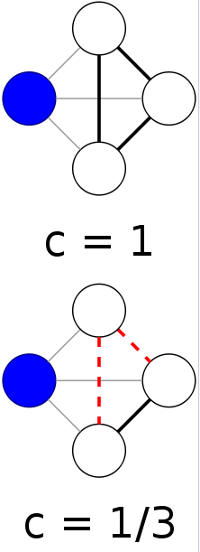
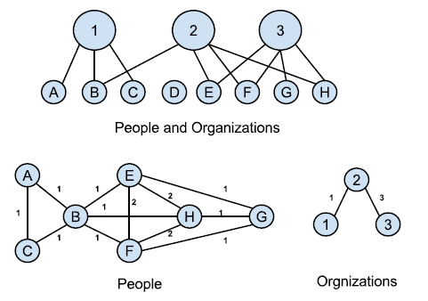
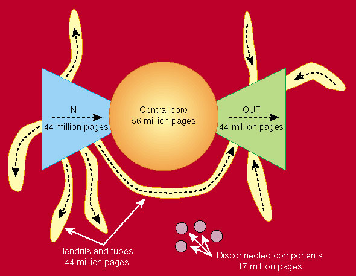
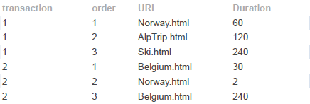
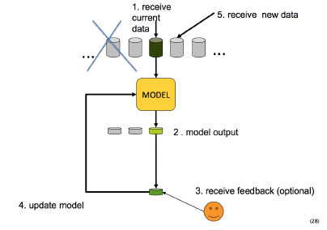

# Poznámky - 2016/2017

*V tomto dokumentu jsem se pokusil sumarizovat informace, ručně vytažené ze slajdů přednášek. Píšu je formou "jak mi to padne na jazyk", takže to může být nespisovně, napůl anglicky, všelijak. Pull requesty vítány.*

## Crawling
- Automatický sběr obsahu na webu, rekurzivně se prochází linky na stránkách a zanořuje se hlouběji a hlouběji.
- Existují specializované nástroje - bots, spiders. Ty většinou umí aplikovat policies - nenavštěvovat tutéž stránku víckrát, ignorovat linky na obrázky, css, atd.
- Problémy:
    - Web je moc velký, musí se vybrat co stahovat.
    - Etika - nedosovat servery, používat User-Agenta, `robots.txt`.
- Terminologie:
    - Seed pages - seznam počátečních URL, ze kterých se pak jede dál
    - Frontier - seznam URL, které čekají na prozkoumání, tj. jakási fronta
    - Fetcher - řeší stahování stránky
    - Link Extractor - řeší parsování stránky a přidávání nových URL do Frontieru (to jsme dělali v úkolu pomocí např. CSS selektorů)
    - URL Filter, Duplicate elmiminator, URL prioritizer

#### Strategie crawlování
- BFS
    - klasický grafový BFS, čim dřív přidám URL do fronty, tím dřív ho pak resolvnu
- Backlink
    - před rozhodnutím, kterou stránku procesovat, si je seřadím podle toho, kolik URL v seznamu na ní ukazuje (tj. kolikrát je v seznamu)
    - Jako první budu řešit stránky, na který je hodně odkazů, takže asi budou důležitý.

Pro kontrolu, kdy se stránka naposled změnila a jestli má cenu jí přecrawlovávat můžu použít `HTTP HEAD`

Je třeba řešit URL normalizaci - transformace URL do její kanonické formy. Něco jako v Linuxu převádění relativní cesty, symlinky atd. na absolutní cestu. Tady se řeší např.:
- Velikost písmen
- Percent-encoding (%20 místo mezery)
- Resolving `.` a `..`

#### robots.txt
- Říká co můžu a co nemůžu indexovat (ale nikdo to neenforcuje - je to o etice)
- Příklad - zakázat GoogleBotu přístup do secret, ale všichni ostatní můžou:
```
User-agent: GoogleBot
Disallow: /secret/
Crawl-delay: 5

User-agent: *
Disallow:
```
- Tohle jde určovat i přímo v HTML stránky (*head.meta*).
- V headeru HTTP lze posílat direktivy botům: `noindex`, `noarchive`, `all`, `nofollow` ...

- Sitemap - standardizovaný XML formát, jak pomoct robotům v indexování:
```xml
<urlset xmlns="http://www.sitemaps.org/schemas/sitemap/0.9"
        xmlns:xsi="http://www.w3.org/2001/XMLSchema‐instance"
        xsi:schemaLocation="http://www.sitemaps.org/schemas/sitemap/0.9 http://www.sitemaps.org/schemas/sitemap/
    <url>
        <loc>http://fit.cvut.cz/</loc>
        <lastmod>2014‐02‐27T15:26:35+00:00</lastmod>
        <changefreq>hourly</changefreq>
        <priority>1.0</priority>
    </url>
</urlset>
```

#### Specific content
- Deep Web - schovaný za formama, přihlašováním, paywally
    - Kontextuální (podle fyzické lokace)
    - Dynamické stránky (response na search query)
    - Non-HTML (videa, audio)
    - Soukromý web

- Obecně se dá těžko projít, dají se dělat věci jako hledání formů v HTML, zkoušet je vyplňovat, upravovat URL query ručně.
- Některý CAPTCHA jdou obejít, některý ne.
- AJAX stránky - jdou crawlovat když jsou dobře napsaný (např.  query `../#!inbox` bot předělá na `../_escaped_fragment_=inbox`, a tohle Google pochopí a naservíruje content, ale obecně problém.
- Spider pasti, dynamický nekonečný generování linků.

- Obsah stránky lze dolovat klasicky nástrojema pro zpracování textu, machine learning, regexpama (odhalí email adresy, telefonní čísla atp.), nějakým učicím automatem, který si postaví z HTML strom a hledá vhodný patterny.
- HTML může být taky anotovaný, aby boti věděli co to je. Např.
```html
<p vocab="http://schema.org/" typeof="Person">
    <span property="name">Christopher Froome</span> was sponsored by
    <span property="sponsor" typeof="http://schema.org/Organization">
    <a property="url" href="http://www.skysports.com/">Sky</a></span> in the Tour de France.
</p>
```
- Je třeba HTML fixnout, ne vždy bude validní.

## Web Data Mining - Indexing & Document retrieval
#### Information retrieval
- Nalezení dokumentů, který uživatelé chtěji, tedy:
    - Na základě sady existujících dokumentů a dotazu
    - Vytvoř ohodnocenou sadu relevantních dokumentů
    - Chci to rychle, napříč milionama nestrukturovaných dokumentů, spolehlivě, škálovatelně.

#### Modely
- jak jsou dokumenty reprezentované
- Boolean model
    - V dokumentech se uvažuje jenom to, jestli se v nich daný term vyskytuje nebo ne (0/1)
    - Queries se udávají booleovskými operátory a termy stylem `term1 AND (term2 OR term3)`.
    - Pro retrieval se řeší *jenom* přesná shoda - dokument buď relevantní je, nebo není.
- Vector Space model
    - Dobře známý a obecně používaný model
    - Používá **TF-IDF** váhové schéma:
        - TF - term frequency - počet výskytů termu v dokumentů (normalizováno celkovým počtem termů v dokumentu)
        - IDF - inverse document frequency - udává, jak je slovo běžné napříč všemi dokumenty: 
        - *TF-IDF = TF × IDF*

    - Příklad:

        > Slovo se vyskytuje 5x v dokumentu se 100 unikátními slovy -> TF = 5/100

        > Máme 10 000 dokumentů a slovo je (alespoň jednou) ve 100 z nich -> IDF = log(10000/100) = 2

        > TF-IDF = 5/100 * 2 = 1/10

#### Vector space ranking
- který dokument zvolit, který je nejpodobnější?

- Query je množina slov, na jejím základě nějak vyberu dokumenty, které obsahují alespoň jedno ze slov
- Query reprezentuju jako vektor (slova -> čísla) (_"hello world hello" -> (1, 0.5)_, první složka je pro _hello_, druhá pro _world_, normalizovaně)
- Každý kandidátní dokument (docX) reprezentuju jako vektor, kde složky vektoru jsou TF-IDF slov z **query**: (tfidf(hello, docX), tfidf(world, docX))
- Spočtu vzdálenost vektoru Query a vektoru *každého* z dokumentů, seřadím od nejbližšího, to jsou moje výsledky.

- Vzdálenosti:
    - Eukleidovská - klasicky odmocnina ze součtu druhých mocnin rozdílů, není dobrá, protože když budu mít v query (term1, term2), tak potom s každou další dvojicí termů term1 a term2 v dokumentu bude vzdálenost růst, i když by logicky měla bejt cca stejná.

        
    - Cosinová - lepší, místo vzdálenosti vektorů se počítá úhel mezi nimi, takže předchozí problém nenastává:

        

        Ve jmenovateli je jednoduše násobení vektorů po složkách.
        Pokud jsou vektory totožné, mají úhel 0 a cos(0) = 1.

#### Evaluation measures
- jak hodnotit kvalitu systému?
- Precision - kolik z vrácených dokumentů je skutečně relevantních? - P(relevant | retrieved)
- Recall - kolik z celkem relevantních dokumentů bylo vráceno? - P(retrieved | relevant)
- F-measure - tradeoff mezi precision/recall:

    

#### Indexing
- sémantika dokumentů a queries jde zachytit množinou index termů - klíčových slov
- **Document index** - klíčová slova, popisující dokument
- indexing - proces vytváření indexu pro každý dokument
- index dokumentů pracuje s *vocabulary* - množinou klíčových slov
    - manuální indexování
        - omezená vocabulary, vytvořena před indexováním
        - kvalitní keywordy, člověk rozumí obsahu, abstrahuje
        - člověk si nevzpomene na celou knihu při indexaci, drahé, pomalé, nekonzistentní
    - automatické indexování
        - nekontrolovaná vocabulary, tvoří se dynamicky při indexaci
        - chcem imitovat lidi, používáme omezený počet termů

- **Inverted index**
    - mapování "keyword" -> "doc1, doc2"
    - tohle je většinou to, co se myslí indexem
    - buduje se předem, na ve chvíli kdy se řeší query
    - používají se standardní struktury pro mapy - hashtables, B-trees
        - hashtable rychlejší lookup, ale při rozumně omezeným počtu termů
        - B-tree delší hledání, ale umí prefix search a najít podobný slova

## Web Data Mining - Text Mining
- Extrakce informací a znalostí z textu

- Proces text miningu:
    1. Sběr dokumentů
    2. Preprocessing dokumentů
    3. Transformace textu, generování featur
    4. Redukce dimenzionality - výběr featur
    5. Pattern discovery, klasicky data mining
    6. Interpretace výsledků

- Tokenizace
    - Nalezení vět, slov -- seskupování znaků do logických celků

- Snížení dimenzionality, převedení tokenů do standardní podoby
    - Lemmatizace - převod do základního tvaru (was, is, are -> be)
    - Stemming - určení kořenu slova (waiting -> wait), částečně řízen pravidly, částečně slovníkově
    - Odstranění stopwords (a, the, it, they)
    - Synonyma, antonyma

- Sentence splitting
    - Rozsekání textu na věty
    - Není triviální, tečka ne vždy ukončuje větu

- Part-of-speech tagging
    - Rozpoznání slovních druhů (noun, proper noun, adjective, verb, pronoun...)
    - Stejná slova můžou mít samozřejmě různé výrazy, není to easy
    - Postupy na tagování:
        - Už mám otagovaný nějaký set dokumentů, tím naučím nějaký klasifikátor
        - Regexp pravidla
        - Obecně pravidla (pokud mam "to XXX", pak je XXX sloveso)
        - N-gramy

- Named entity recognition
    - Identifikace entit a klasifikace, co to je za entitu
    - NER dělá:
        - Rozpoznání entit
        - Klasifikace
        - Disambiguation tím, že ke třídě ještě přiřadím třeba Wikipedia URL s tou entitou
    - Založeno na gramatikách nebo Gazetteers, což jsou seznamy/slovníky států, lidí, geolokací
    - Množina tříd může být předdefinovaná, nebo dynamicky tvořená (LOC, GPE, ORG, MISC)
    - Slova jsou mnohoznačná, NER může použít *linking*, aby se tomu vyhnul - k entitě přidá odkaz na nějakej jednoznačnej zdroj.
    - *Coreference* - různý kusy textu označují tutéž entitu, chcem je tak i stejně označit (Mary Smith, Mrs. Smith)

- Relation Extraction
    - Vytěžování sémantických vztahů mezi entitami (X pracuje pro Y)
    - Naivně se dají hledat fixní slovní patterny, ale to neškáluje
    - Řeší se lingvistickou analýzou (tagging slovních druhů, sestaví se parsing tree, z toho se určí podmět, předmět, přísudek)

- Opinion Mining
    - Identifikace názorů, emocí, sentimentu z textu - většinou se zkoumá pozitivní, negativní nebo neutrální

    1. Opinion Extraction - identifikace textu, který obsahuje názor, emoce.
    2. Sentiment Analysis - neřeší komplexnější názory, jen hledá pozitivní/negativní.
    3. Opinion Summarization - vypočtení celkového názoru z předchozího bodu

    - Lexicon-based - mám seznam dobrých a špatných slov a proti tomu porovnávám. Jsou tu ale issues, třeba před tím slovem dám *not*, nebo je to jenom otázka, nemá to sentiment. Můžu dál expandovat lexikon například hledáním synonym (stejná polarita), antonym (opačná polarita) - WordNet.

    - Sentiment learning
        - Supervised - mám anotovaná data, na kterých trénuju, například to seberu z recenzí produktů a hvězdiček
        - Unsupervised - sentiment bude na daných frázích slovních druhů, např "ADJ NN"

- Text summarization
    - Cíl je vytvoření abstraktu, shrnutí textu
    - Kroky:
        - Content selection - jaký věty budu vůbec ve zdroji uvažovat
        - Information ordering - jak informace uspořádám
        - Sentence realization - "vyčištění" vět, zjednodušení
    - Postupy:
        - Frequency-based - hledám často se opakující N-gramy, ty potom nějakým způsobem spojím.
        - Baseline Single Document - hledám nejdůležitější slova v textu, k nim pak clustery okolních důležitých slov, pak vypočtu skóre každého z clusterů a ve finále budu uvažovat věty, které mají clustery s nejvyššími skóre.

- *NIF*
    - Natural language processing Interchange Format
    - Standard anotací, má URI schéma

## Web Data Mining - Social Network Analysis
- Je to o dost starší než Facebook, studuje lidské vztahy pomocí teorie grafů
- Typy analýzy:
    - Sociocentrická - analýza celé sítě, identifikace globálních struktur
    - Egocentrická - analýza okolí jednoho člověka, kvantifikace interakcí mezi jedním uzlem a ostatními
    - Knowledge-based - pochází z computer science, kvantifikuje interakce mezi uživateli, skupinami a dalšími entitami v síti

- Kevin Bacon / Paul Erdös number - six degrees of separation
- Measures of centrality:
    - Metriky pro měření důležitosti, popularity nebo sociálního kapitálu uzlu v síti, na základě jejich connection patterns
    - Degree centrality - stupeň uzlu - počet hran vedoucí do/z uzlu
    - Closeness - *1 / (součet vzdáleností do všech ostatních uzlů)*
    - Betweenness - počet nejkratších cest všech ostatních uzlů, které vedou skrz uzel X dělený počtem všech nejkratších cest
    - Eigenvector - podobně jako PageRank, iterativně. Uzel s vysokou Eigenvector centralitou je propojen s uzly, které ji mají taky velkou, tedy "kdo je propojen s hodně propojenými uzly?"

#### Clustering
- Clustering coefficient
    - pravděpodobnost, že dva náhodní kamarádi daného uzlu jsou taky navzájem kamarádi. Udává koncentrovanost vztahů v clusteru, či globálně úroveň clusterovatelnosti.
    - (*počet hran mezi sousedy uzlu X*) děleno (*maximální počet hran mezi sousedy uzlu X*)
    - Viz níže - šedé i černé hrany jsou platné, červené neplatné

    

- Bridge
    - Smazáním hrany mezi dvěma uzly by se tyto uzly ocitly ve dvou různých komponentách (vzácné)
    - **Local bridge** - pokud dva uzly nemají žádné společné přátele, tedy rozpojením by jejich vzdálenost vzrostla na víc než dva.
    - Embeddedness(A,B) - počet společných sousedů A, B

#### Network-level characteristics
- **Density**
    - Poměr hran grafu vůči všem možným hranám (pokud by byl plný, tj. neorientovaný *n(n-1)/2*)

- **Reciprocity**
    - U orientovaných grafů
    - Poměr spojení, které vede oběma směry, vůči všem spojením.

- **Components**
    - Klasická komponenta grafu - spojitý podgraf.

- **Homophily**
    - Mám dva typy uzlů, např. muži-ženy, bílý-černý. Homophily je, pokud se spolu druží spíš v rámci sexu/rasy než aby se družili se všema.
    - Pokud je počet cross-gender hran výrazně nižší než 2*p*q (kde p, q je podíl té které skupiny), pak je homophilie.

- **Community detection**
    - Jsou CS způsoby a sociologický způsoby
    - Obecně, komunita je podmnožina uzlů, ze které do zbytku grafu vede míň hran než kolika je prolinkovaná komunita (ještě neexistuje přesná definice)

    - **Cliques**
        - Úplný podgraf - každý je s každým v rámci kliky propojen

    - **Partitioning**
        - Rozdělení grafu na dva clustery, chceme minimalizovat počet uřízlých hran
        - *Kernighan-Lin* algoritmus:
            *TODO? Nevim jestli to má význam.*
        - *Hierarchical clustering*
            - Sestavení stromu clusterování na základě nějaké podobnosti
        - *Betweenness* - spočtu betweenness všech dvojic uzlů, uříznu hrany s nejmenší hodnotou
        - *Island method* - pro každý uzel spočtu "výšku", například centralitu, a pak postupně zvedám "vodu" - nějaký threshold, který mi graf rozdělí.
        - Komunity se ale často překrývají, existují na to taky nějaký algoritmy, jak je identifikovat.

- **Link prediction**
    - Sítě jsou vysoce dynamické, pořád se mění. Chci predikovat, kde se budou tvořit hrany (doporučování přátel, interakce mezi proteiny v bioinformatice, doporučovací systémy)
    - Využívá se známých charakteristik:
        - Svět je malý, průměrná vzdálenost v síti je docela malá v porovnání s velikostí sítě
        - Většina nodů má krátký linky
        - Existují clustery přátel, známých a tak podobně
    - Obecně těžký problém, mám 1/(V^2) pravděpodobnost, že se trefím.
    - Algoritmy:
        - Graph Distance - čím kratší cesta, tím spíš se vytvoří hrana. *score(x,y) = -shortestPath(x,y)*
        - Common Neighbors - *score(x,y) = <počet společných přátel>*

- **Multinode networks**
    - Grafy, kde je víc typů uzlů, např. lidi a společnosti(linkedin), přátelé a stránky (fb)
    - *Affiliation networks* - nepřímé, tranzitivní propojení přes druhý typ uzlu. Počet hran se sečte a ve výsledném grafu tím bude ohodnocena odpovídající hrana:

        

## Web Data Mining - PageRank & HITS

- Power Law - pravděpodobnost, že uzel v síti má stupeň *i* je *1/i^x*, kde *x~2.1*.
- Bow-Tie structure - internet je strukturovaný do "tvaru" motýlka, je tam:
    - Centrální jádro - většina stránek, to je silně propojený
    - IN - stránky, který linkujou do jádra, ale odkazy nevedou naopak (nový, nezaindexovaný stránky)
    - OUT - stránky, kam vedou odkazy z jádra, ale nelinkujou zpátky (interní korporátní stránky)
    - Tendrils - Stránky dostupné z IN, ale nevedou do jádra
    - Tubes - dostupné z IN, ale vedou jen do OUT
    - Disconnected - nikam nelinkujou, nikdo je nelinkuje

    

- Klasické Information Retrieval modely mají problémy (boolean, vector models) - výsledků je moc, všechny stránky jsou defaultně brány jako stejně relevantní, relevance se počítá jen na základě textu.
- IR se dá jednoduše obejít, např. spam keywordů, SEO.
- Potřebujeme jiné skóre pro relevanci. Struktura webu je nejlepší dosud známý zdroj dodatečné informace o popularitě.

#### PageRank
*Poznámka editora - spočtěte si nějaký příklady, alespoň jednu, dvě iterace, je to v přednáškách. Chci to tu zachovat kompaktní, příklady sem dávat nebudu.*

- Využívá graf linků jako indikátor kvality stránek, prestiž stránky je proporcionální součtu prestiže stránek, které na ni odkazují - a je nezávislá na search query, takže se dá v klidu předpočítat a nemusí se toho dělat tolik realtime.
- Základní myšlenka je ta, že prestiž se mezi stránkama přelévá jako tekutina, pokud důležité stránky linkují nějakou další, tak ta dostane kus té důležitosti.

- **Výpočet**
    - Výpočet probíhá iterativně, každá iterace používá hodnoty z té předchozí.

    1. PR všechn stránek se inicializuje na nějakou hodnotu, například 1/n (součet má být 1).
    2. Hodnota PageRanku pro každou stránku *P<sub>i</sub>*, kde *P<sub>j</sub>* jsou stránky, které na ni linkují: 
        - stránka "pošle" těm, na které linkuje, poměrnou část svého PR, rovnoměrně rozdělenou.

    - Iterativní výpočet lze reprezentovat maticí a pro iterování jen opakovaně násobit.
    - PageRank je pak vektor, jeho velikost je počet stránek v síti.
    - **Matice H**
        - Základní metoda, matice `n×n`, tam kde nejsou hrany má nuly, tam kde hrany jsou, má takový zlomek, aby v řádku byl součet 1 (nebo 0, pokud není žádná hrana ven):

            

            
        - Každá iterace *O(n<sup>2</sup>)*, ale matice je řídká, existujou efektivnější algoritmy.
        - Problémy:
            - Web graf má stránky bez out-linků (=*rank sinks*, postupně žerou všechen PR, ten u nich mizí)
            - Má cykly, kde by se PR zasekl a osciloval
            - Má uzavřené kliky, které si všechen PR syslí pro sebe
        - Alternativní definice PageRanku - **náhodný surfař**
            - Matice se nápadně podobá přechodové matici Markovských řetězců (hurá, *SPI*), ale jsou řádky, co nemají součet 1.
            - Vyberu náhodnou stránku kde začnu, pak udělám náhodně *k* kroků sítí (tj. vybírám náhodné odkazy na stránkách)
            - Pravděpodobnost, že bude random surfař na stránce *X* po *k* krocích náhodné procházky je totožný jako PageRank stránky *X* po *k* iteracích.
    - **Matice S**
        - Mám stejný problém jako před chvílí, ale mám i řešení - *teleportace*! Pokud ze stránky nevede *žádná* hrana, pak uměle přidám hrany do všech stránek v síti:

            

        - Tohle už je matice přechodů diskrétního Markovského procesu
        - ALE pořád není ireducibilní a může být periodická (oscilace PR)
        - Tj. výpočet **nemusí konvergovat**.
    - **Matice G** - Google Matrix
        - Řešením předchozího je matice, kde *S* vynásobím konstantou, *d*, damping faktorem, a ke všem prvkům přičtu *(1-d)/n*. V praxi se používá damping factor ~ 0.85.

            
        - Výpočet probíhá stejně jako na začátku, opakované násobení matice PR vektorem.
        - Žádné nulové prvky v matici, je stochastická, aperiodická, ireducibilní, primitivní
        - **Konverguje.**
    - Dá se dál modifikovat např. inteligentním surfařem, modifikací teleportace (matice S).

#### HITS
- Oproti PR celý výpočet závisí na search query
- Je rychlejší než PR, zpracovává méně stránek

- Dva koncepty - **authority** a **hub**:
    - Authority - stránka, na kterou vede dost linků - pokud lidi věří stránce, budou na ní odkazovat, a bude z ní autorita
    - Hub - rozcestník, vedou z něj odkazy pryč - dobré rozcestníky ukazují na autority
- Cílem je najít nejlepší autority a rozcestníky pro dotaz

- **Výpočet**
    - Pro danou search query se nejdřív nějak získají root stránky (text retrieval, přes jiný vyhledávač, nějak).
    - Stránky se expandují o jejich linky, tím se vytvoří set stránek, se kterými se pracuje.
    - Iterativní výpočet:
        - Autority-skóre stránky je součet hub-skóre stránek z minulého kroku, které na tuto stránku odkazují.
        - Hub-skóre stránky je součet autority-skóre stránek z minulého kroku, na které tato stránka odkazuje.
    - Jde to počítat maticově, jako PageRank:
        - *a = L<sup>T</sup> × h*
        - *h = L × a*

- Vždy konverguje
- Nemá anti-spam featury, stránka s hodně linkama se stane dobrým hubem

## Web Usage Mining, Web Analytics

- Tři vzájemně závislé fáze:
    1. **Preprocessing, data collection** - dostanu logy, musím to vyčistit, identifikovat transakce, doplnit informace o session na základě znalosti struktury stránky atd.
    2. **Pattern discovery** - detekce patternů pomocí machine learningu, statistických toolů; sumarizace sessions, uživatelů
    3. **Pattern analysis** - filtrování, agregace, validace, interpretace nalezených vzorů chování

- **Vstupní data**
    - Hlavně *usage data*, reálná data z produkce, logy aplikací
        - čas, IP, URL, status, User-Agent, Cookies
        - Agregovaně **pageview** (jedna user-action, otevření jedné resource/stránky), **session** (posloupnost pageviews během jedné návštěvy webu)
    - *Content data* - kolekce objektů a vztahů mezi nimi. Textuální data a multimédia (HTML, obrázky)
    - *Structure data* - organizace obsahu na portálu, struktura odkazů - graf

#### Collecting & preprocessing
- **Data collecting**
    - Explicitně - nejjednodušší, lidi vyplňujou dotazníky, hodnotí. Může být vysoká kvalita, ale uživatele nebaví něco vyplňovat.
    - Implicitně - neinvazivní, na základě klikání na stránce, eye tracking, postura, výrazy v obličeji, gesta. Privacy problémy kvůli monitorování uživatelů.
    - Web logy (apache, nginx)
    - Client-side JS trackers - populární, na webu je data collecting JS overlay, který reportuje co uživatel dělá, aniž by se muselo něco instalovat a lépe se to interpretuje než prostý logy. Dají se tak identifikovat:
        - **Referral** - jak se sem uživatel dostal? Při prvním přistání na stránce - bylo to na základě search query, nějaký reklamy, kampaně?
        - **Referrer** - informace o současné relaci
        - Custom proměnné a flagy.

- **Preprocessing**
    - Cleaning - odstranění záznamů od crawlerů, error hlášek, přístupů k obrázkům, js, css (pokud to z nějakýho důvodu nepotřebuju)
    - Identifikace **pageview** - záleží na konkrétním usecase jak to udělat
    - Identifikace **uživatele** - přiřazení unikátního ID ke všem záznamům, které pocházejí od jednoho uživatele
        - Unikátní cookies
        - IP samotná většinou nestačí, NATuje se -> IP+User-Agent
        - HTTP headery, pluginy, font, Canvas atd. ("fingerprints")
    - Identifikace **session** - seskupení různých log záznamů do skupin (podle uživatele i času)
        - Předpoklady, např. délka session bude max 30 minut, délka strávená na jedné stránce bude max 10 minut
        - Referrer současné stránky už je součástí session, jinak začni novou

#### Pattern discovery
- **Data modelling**
    - Mám pageviews jako množinu P
    - Ke každému pageview váha, např. binární, podle toho, jak dlouho uživatel na stránce zůstal, kolikátá v pořadí stránka byla
    - *Transakce* - množina pageviews a vah

    - **User-pageview matrix (transaction matrix) - UPM**
        - pořadí pageviews není důležité
        - ve sloupcích jednotlivé stránky (nebo eventy ve stránce), v řádcích transakce

            
        - problém s dimenzionalitou

    - *Semantic Information Integration*
        - Pageview je moc jemná granularita, spíš než stránky mě zajímají featury, sémantický popis toho, co uživatel dělá
        - Keywords na stránce, např. cena produktu, kategorie
        - Klasifikace pageview - detail produktu, navigace mezi produkty, úvodní strana?
        - Tyhle featury se sestavujou během *data collection phase*.
    - **Pageview-feature matrix - PFM**
        - Pro každou stránku mám vektor vah fičur:

            
    - **Content-enhanced transaction matrix (transaction-feature matrix) - TFM**
        - Sestaveno vynásobením *UPM × PFM* - každý řádek je transakce, ve sloupcích pak featury z *PFM*.

        - Data: 
        - UPM: 
        - PFM: 
        - TFM: 

- **Clustering**
    - Mám data, teď hledam něco zajímavýho - clustery uživatelů, stránek
    - Standardně třeba *k-means*, podobnost v clusterech max, podobnost mimo cluster min, jako metriku třeba cosine similarity

    - Nejčastěji clusteruju uživatele, hledám ty, co mají podobný surfovací vzory - aplikace v segmentaci trhu, personalizaci, komunitách.

- **Association analysis**

    - Hledám skupiny předmětů, stránek, které jsou často koupeny/navštíveny dohromady -> doporučení uživatelům "ostatní s tímhle koupili tohle"
    - Algoritmus **apriori**
        - Tvorba pravidel typu *{párky, hořčice, chleba} -> {pivo}*. (*antecedent => consequent*)
        - **Support**
            - procento nákupů, který obsahujou všechny čtyři věci
            - *sup(X) = <počet záznamů obsahující X> / <počet všech záznamů>*
        - **Confidence**
            - kdo koupí párky, hořčici a chleba koupí taky s *confidence*-pravděpodobností pivo.
            - *conf(X=>Y) = sup(X U Y) / sup(X)*

            

        - Dva parametry:
            - `min_sup` - minimální hladina *supportu*
            - `min_conf` - minimální hladina *confidence*

        - Kroky:
            1. Vygeneruj dostatečně supportovaný množiny transakcí (množiny, který mají support alespoň `min_sup`
                1. Z transakcí vem jednoprvkový množiny X, spočti sup(X), nech jenom ty, co mají dostatek support
                2. Z přeživších množin vytvoř dvouprvkový množiny X, spočti sup(X), nech jenom ty, co mají dostatek support
                3. Zase, z přeživších dvouprvkových množin vytvoř tříprvkový (sjednocením množin), spočti sup(X), atd.
            2. Vygeneruj dostatečně confidentní asociační pravidla z předchozích setů (pravidla, který mají alespon `min_conf`)
                1. Z každý množiny co měla dostatečnej support vytvoř permutace dvou podmnožin, což bude pravidlo. Tedy z množiny M, (X U Y) = M, X=>Y.
                2. Pro každý pravidlo *X => Y* spočti confidence, *conf(X=>Y) = sup(X U Y)/sup(X)*. Pokud je dost velká, uložím pravidlo a opakuju.

        - Příklad

            > |Transakce|
            > |---------|
            > |1,3,4|
            > |2,3,5|
            > |1,2,3,5|
            > |2,5|
            >
            > Min support 50%, tedy *4/2=2*
            >
            >|Množina|Support|Poznámka|
            > |-------|-------|--------|
            > |1      |2      |        |
            > |2      |3      |        |
            > |3      |3      |        |
            > |~~4~~  |~~1~~  |Vyhazuju|
            > |5      |3      |        |
            > |-------|-------|--------|
            > |~~1,2~~|~~1~~  |Vyhazuju|
            > |1,3    |2      |        |
            > |~~1,5~~|~~1~~  |Vyhazuju|
            > |2,3    |2      |        |
            > |2,5    |3      |        |
            > |3,5    |2      |        |
            > |-------|-------|--------|
            > |~~1,2,3~~|~~1~~  |Vyhazuju|
            > |~~1,3,5~~|~~1~~  |Vyhazuju|
            > |2,3,5  |2      |        |
            >
            > Teď pro každou z množin co jsem nevyhodil a má alespoň dva prvky vytvořím kandidátní pravidla, tj.
            > ```
            > 1 -> 3
            > 3 -> 1
            > 2 -> 3
            > 3 -> 2
            > ...
            > 2,3 -> 5
            > 2 -> 3,5
            > ...
            > ```
            > A pro každý pravidlo vypočtu confidence ze supportů jednotlivých množin.

        - Apriori neumí pracovat s váhama jednotlivých featur, takže musím nějak převést matici tak, aby měla jenom 0 a 1:
            1. Co je 0, bude 0, cokoliv jinýho bude 1.
            2. Featury rozsekám na intervaly, např. "důležitost" -> *"důležitost <20", "důležitost (20, 50)", ...)* - tady ale vytvářím dimenze
        - V praxi hledám pravidla jako:
            `{Referral=GoogleSearch, Hour=Morning} -> {Purchase=True}`

#### Web Analytics
- Analýza toho, jak se uživatelé chovají na webu, chci celkový přehled o trendech
- Dvě kategorie:
    - **Traffic Analysis** - pageviews, sessions, time
    - **E-commerce Analysis** - Conversion, Revenue, Campaigns, Impressions

## Recommender Systems

*Kdykoliv tu mluvím o filmech, mám tím na mysli jakýkoliv doporučovaný objekt, takhle to bylo jednodušší napsat.*

- Všude je moc informací, hodiny videí každou minutu, lidi to nemůžou zvládnout projít. Všichni doporučujou - Google, Youtube, Amazon, Netflix.
- **Personalizace** - hlavní myšlenka v doporučovacích systémech. Předpoklady
    - Pokud jsou uživatelé A a B nějakým způsobem podobní, tak potom bude uživatel A pravděpodobně chtít věci, co chtěl B.
    - Pokud chtěl uživatel nějaký item I, tak v budoucnosti bude pravděpodobně chtít věci podobné itemu I.

- Typy doporučování
    - **Collaborative filtering**
        - *User-based* - identifikuju podobný uživatele tomu, kterému chci doporučit. Na základě toho, co se jim líbilo, vyberu něco.
        - *Item-based* - jde to i podle filmů, spočtu podobnost vektoru hodnocení od všech uživatelů, tím zjistím jak jsou filmy asi podobný, a doporučím podobný těm, který uživatel ohodnotil dobře. *(pořád tady neřeším obsah, řeším jen podobnost v hodnoceních)*
        - Podobnost řeším zase cosinovou vzdáleností, nebo třeba Pearsonovou metrikou.
        - *Matrix Factorization* - chci objevit latentní(skrytý) faktory uživatelů nebo filmů, a použít je pro doporučení. Místo matice User×Rating budu mít dvě matice - User×Userfeature a Movie×MovFeature, vynásobením získám jediný číslo a to je doporučovací skóre.
        - *Nevýhoda* je, že už musím mít dostatečný množství hodnocení od nějakých uživatelů. Matice bývá řídká, je těžký najít lidi, co hodnotili podobný věci jako já. Nové filmy nejsou vůbec doporučovány a naopak mainstream je doporučovaný pořád, nedá se to použít pro hipstery.
    - **Content-based filtering**
        - analyzuju obsah věcí, na který se uživatel díval. Podle toho pak doporučím podobný věci. Tady ale potřebuju nějaký metadata o věcech.
        - Např. filmy reprezentuju jako vektor žánrů a jejich příslušnosti k nim *(SciFi:1, Western:0, Drama:0.5)*. Pro uživatele sestavím stejný vektor podle toho, co hodnotil (normalizuju do 0-1). Pak počítám podobnosti.
        - *Výhoda* - nepotřebuju data od ostatních, hipsteři dostanou co chtěj.
        - *Nevýhoda* - musím být schopen zakódovat vkus lidí do vektoru, jedhoduše přeučím model, možná je to až moc předvídatelný, nejsou tam žádný "milý překvapení".
    - **Knowledge-based filtering**
        - v situacích, kdy nemám moc informací. Využívám znalostní databázi, není to personalizované. Jednoduše, *jsem v tomhle kontextu, co mám doporučit?*
        - typicky pro drahý, unikátní věci; doporučení se mění s časem (rychle se měnící prostředí nabídky, např. elektronika); interaktivní - uživatel si může naklikat co preferuje
        - Potřebuju znalost domény, např. *chci byt na vesnici -> ok, projdu databázi lokalit a vrátím jenom vesnice* - uživatel si stanoví **omezující podmínky**.
        - Můžou taky postupným klikáním na množinu věcí určit co tak chtějí
    - Podle demografie, kombinace přístupů atd.

- Testování kvality
    - *Offline* - musím mít nějaký baseline dataset a očekávaný doporučení, simuluju uživatele. Probém s overfittingem.
    - *User-studies* - reálný uživatelé, říkají jestli jo nebo ne. Drahý.
    - *Online* - A/B testing. Tam ale hrozí, že část uživatelů (která dostane ten "experimentální" doporučovač) může být naštvaná.

- Vysvětlení, důvod doporučení
    - Když uživateli řeknu proč doporučení dostal, bude víc systému věřit, bude spokojenější.
    - Rychleji se může rozhodnout, jestli je doporučení správné - pokud je důvod nesmysl, tak nemá cenu poslouchat co doporučil.

- Collaboration filtering je náchylný na útoky. Boti můžou hodnotit můj film dobře, nebo filmy konkurence špatně, a tím ovlivňovat systém.
    - Jako útočník můžu hodnotit dobrý filmy dobře, špatný špatně, a tím schovat (v průměru) můj útok na konkrétní filmy.
    - Obrana proti útokům - unsupervised, supervised, podle chování uživatele, srovnání hodnocení proti ostatním, CAPTCHA.


## Data Streams Mining
- Moc dat, nevejdou se do paměti ani databáze. Nejsou statická, neustále se generují.
- Web data, sensor data, activity data, spam detection
- Pokud je rozdělení dat statické, můžu ukusovat kusy streamů a klasicky miningovat. Rozdělení dat se ale může měnit.
- Obecně:

    

    - One-pass
    - Rychlé zpracování každého chunku
    - Nezpracovávám všechno, nějak si to naskečuju

- **Sampling**
    - *Reservoir sampling* - udržuju si buffer vzorků, když přijde novej, s určitou pravděpodobností ho uložím a nějakej jinej vyhodim.
    - *Moving windows* - okénko, udržuju si jen omezenou historii. Tímhle řeším to, že třeba stará data expirovala.
    - *Sketching* - nesoustředím se jen na poslední kus dat, snažím se sumarizovat všechna data, s různou úrovní detailů

- *Počítání frekvencí* - mám n druhů prvků, chci počítat kolikrát co přišlo
    - Pokud mám pole o n prvcích, je to easy, ale paměťově náročný.
    - **Count-min Sketch** - ukládám počty v omezeném poli, indexuju podle hash funkce - ztrácím informaci, počitadlo udává spodní mez (může jich být nakombinováno víc, kvůli kolizi hash fce)
    - **Lossy Counting** - stream rozdělím na chunky, jeden chunk zpracuju kompletně, po jeho konci od všeho odečtu 1. Tímhle identifikuju časté itemy.
    - **Distinct items counting** - chci vědět, kolik rozdílných itemů přišlo. Efektivně *HyperLogLog* algoritmus: itemy zahashuju do binární podoby, najdu nejvyšší řetězec trailing nul a odhadnu, že počet unikátních itemů bude 2<sup>n</sup>.
        - Kdybysme viděli 2 různé itemy, čekal bych 1 trailing nulu.
        - Kdybysme viděli 4 různé itemy, čekal bych 2 trailing nuly, atd.